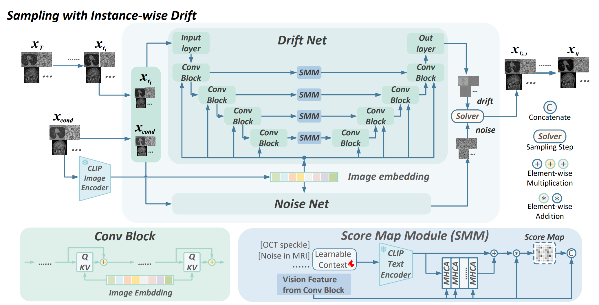

## InstanceDiff: Instance-wise Drift Score-Based Diffusion Model for All-in-one Medical Image Restoration

> Official Pytorch Implementation of InstanceDiff

[Project Page](https://github.com/zyc-123/InstanceDiff) | [Paper](https://services.arxiv.org/html/submission/5991491/view) | [Model Card]() 🤗



### Updates

[**2024-11-11**]: Code is submitted

### TODO List

- [X] Release project Code
- [ ] Upload Checkpoints
- [ ] Release Dataset (main)
- [ ] Release Dataset for zero-shot

### How to run

Dependancies:

- CentOS 7.5
- GPU: NVIDIA Tesla A100
- Cuda 11.6
- Python 3.9
- Pytorch 1.13.1

#### Train

For distribution training:

```
python -m torch.distributed.launch --master_port=12622 --nproc_per_node=2 trainUM.py -opt=path/to/train_config.yml --launcher pytorch
```

For non-distribution training:

```
Python trainUM.py -opt=path/to/train_config.yml
```

#### Test

```
Python test_UnifiedMed.py -opt=path/to/test_config.yml
```

#### Dataset

The dataset processed by us can be downloaded through [Dataset-Across-Five-Modality]()

Or the source datasets can be downloaded via following links:

|                       | Ultrasound-Sp | Cryo-EM-N | OCT-Sp | MRI-N | LoDoPaB-CT |
| --------------------- | ------------- | --------- | ------ | ----- | ---------- |
| Train/Validation/Test |               |           |        |       |            |
| Source Link           |               |           |        |       |            |

##### Prepare your own dataset

1️⃣ Prepare Dataset. Each sample should include 3 element: clean image, noised image, and noised image embedding by CLIP.

2️⃣ Prepare '.json' file, comprising three subset: 'train', 'test', and 'val'; and each element should consist of 4 attribution:

- 'A': path to noised image
- 'B': path to clean image
- 'emb_A': noised image embedding by CLIP
- 'name': text prompt identifying which modality and noise; for example: 'speckle noise in OCT'

The structure of the '.json' file should be:

```json
"train": [
	{
		"A": "/path/to/noise/image",
		"B": "/path/to/clean/image",
		"emb_A": "/path/to/noised/image/embedding/by/CLIP"
	},
	...
],
"val": [
	{
		"A": "/path/to/noise/image",
		"B": "/path/to/clean/image",
		"emb_A": "/path/to/noised/image/embedding/by/CLIP"
	},
	...
],
"test": [
	{
		"A": "/path/to/noise/image",
		"B": "/path/to/clean/image",
		"emb_A": "/path/to/noised/image/embedding/by/CLIP"
	},
	...
]
```

3️⃣ Modify the "dataset_file" domain in configuration file.
